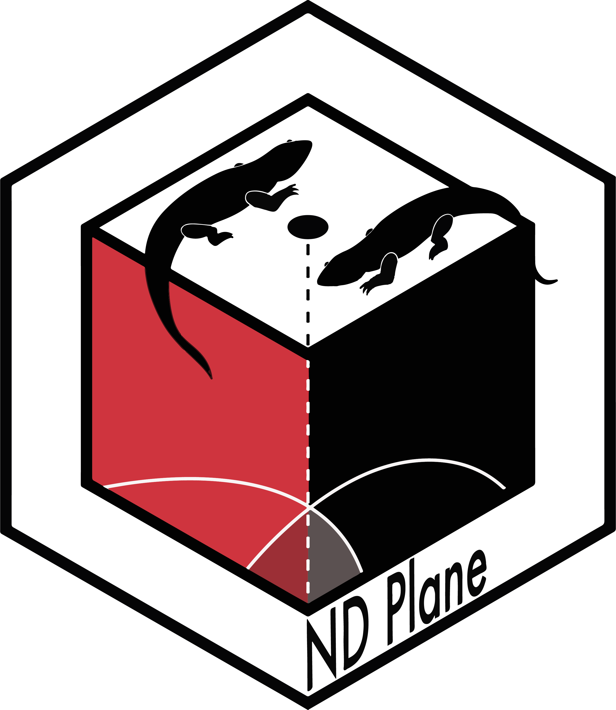

<!-- README.md is generated from README.Rmd. Please edit that file -->

# ndplane 

<!-- badges: start -->

[](https://CRAN.R-project.org/package=ndplane)
[](https://github.com/ascanioalfredoa/ndplane/actions/workflows/R-CMD-check.yaml)
<!-- badges: end -->

The goal of _ndplane_ is to 

## Installation

You can install the development version of ndplane from
[GitHub](https://github.com/) with:

``` r
# install.packages("pak")
pak::pak("ascanioalfredoa/ndplane")
```

## Example

This is a basic example which shows you how to solve a common problem:

``` r
library(ndplane)
## basic example code
```
